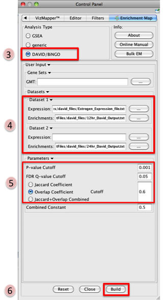
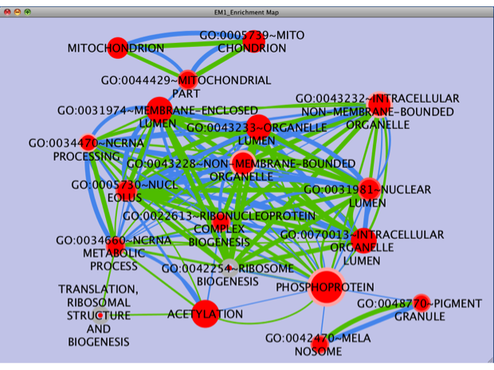

.. _david_tutorial:

David Tutorial
==============

Outline
-------

This quick tutorial will guide you through the generation of an Enrichment Map for an analysis 
performed using DAVID Functional Annotation Tool,

To run this tutorial:

* You need to have Cytoscape installed : minimally 2.6.3 must be installed but preferable to 
  have the latest version of Cytoscape (e.g. version 3.1)
* Install the Enrichment Map plugin from the Cytoscape plugin manager. If you install it 
  manually (e.g. if you need to install a new version that doesn't happen to be in the plugin 
  manager yet), then it must be in the Cytoscape-[Version#]/plugins folder --> For Cytoscape 2.8
* Install the Enrichment Map App from the Cytoscape App manager in cytoscape 3. --> For Cytoscape 3.
* Download the test data: :download:`DavidTutorial.zip <downloads/DavidTutorial.zip>`

Description of the tutorial files contained in the DavidTutorial folder:

* ``12hr_topgenes.txt`` List of top genes expressed in Estrogen dataset at 12hr - 
  Official Gene Symbol.
* ``24hr_topgenes.txt`` List of top genes expressed in Estrogen dataset at 24hr - 
  Official Gene Symbol.
* ``12hr_David_Output.txt`` Estrogen treatment - 12hr DAVID result chart - 
  Screen shot of where to get DAVID output chart
* ``24hr_David_Output.txt`` Estrogen treatment - 24hr DAVID result chart
* ``Estrogen_expression_file.txt`` Expression File - Estrogen treatment, Official Gene Name as key. 

Instructions
------------

Step 1: Generate DAVID output files
~~~~~~~~~~~~~~~~~~~~~~~~~~~~~~~~~~~

* GO to DAVID website - http://david.abcc.ncifcrf.gov/
* Select and copy all genes in the tutorial file 12hr_topgenes.txt
* In Upload tab of DAVID interface Paste genes in text box marked Step 1: Enter Gene list
* Select Official Gene Symbol in Step 2: Select Identifier
* Select Gene list in Step 3: Select List Type
* Click Submit list
* Select species: Homo sapiens
* Click Functional Annotation Chart - Screen shot of where to get DAVID output chart
* Download file - This is the file you can use in Enrichment Map (Dataset 1 or 2:Enrichment Results) 

.. note:: Repeat these steps for the 24hrs time-point and the file 24hr_topgenes.txt

Step 2: Generate Enrichment Map with DAVID Output
~~~~~~~~~~~~~~~~~~~~~~~~~~~~~~~~~~~~~~~~~~~~~~~~~

* Open Cytoscape
* Click on Plugins / Enrichment Maps / Load Enrichment Results
* Make sure the Analysis Type is set to DAVID/BiNGO
* Please select the following files by clicking on the respective (...) button and 
  selecting the file in the Dialog:

  * NO GMT file is required for DAVID Analysis
  * Dataset 1 / Expression: Estrogen_expression_file.txt (OPTIONAL)
  * Dataset 1 / Enrichments: 12hr_David_Output.txt
  * Click on "Dataset 2 arrow_collapsed.gif" to expand the panel
  * Dataset 2 / Expression: leave empty
  * Dataset 2 / Enrichments 1: 24hr_David_Output.txt (OPTIONAL) 

* Tune Parameters

  * P-value cut-off 0.001
  * Q-value cut-off 0.05
  * Check Overlap Coefficient

    * Overlap coefficient cut-off 0.6 

* Build Enrichment Map
* Go to View, and activate Show Graphics Details 

.. note:: There are multiple values in DAVID that can be used for the Q-value 
          in EM including Bonferroni, Benjamini, and FDR. In EM we use the Benjamini 
          as the Q-value.

Step 3: Examining Results
~~~~~~~~~~~~~~~~~~~~~~~~~

Legend:

* Node (inner circle) size corresponds to the number of genes in dataset 1 within the geneset
* Node border (outer circle) size corresponds to the number of genes in dataset 2 within the geneset
* Colour of the node (inner circle) and border(outer circle) corresponds to the significance 
  of the geneset for dataset 1 and dataset 2, respectively.
* Edge size corresponds to the number of genes that overlap between the two connected genesets. 
  Green edges correspond to both datasets when it is the only colour edge. When there are two 
  different edge colours, green corresponds to dataset 1 and blue corresponds to dataset 2.

.. note:: If you are using two enrichment sets you will see two different colours of edges in 
          the enrichment map. When the set of genes in the two datasets are different (for example, 
          when you are comparing two different species or when you are comparing results from two 
          different platforms) the overlaps are computed for each dataset separately as there is a 
          different set of genes that the enrichments were calculated on. In this case, since the 
          enrichments were reduced to only a subset of most differentially expressed at each time 
          point the set of genes the enrichments are calculated on are different and overlap are 
          calculated for each set separately. 
          