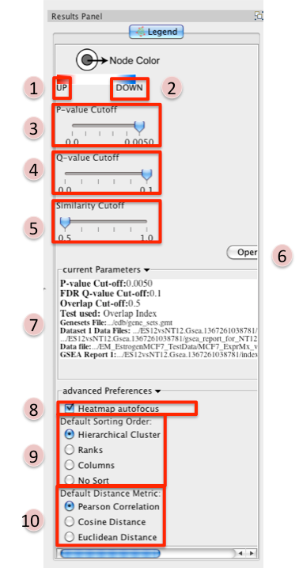
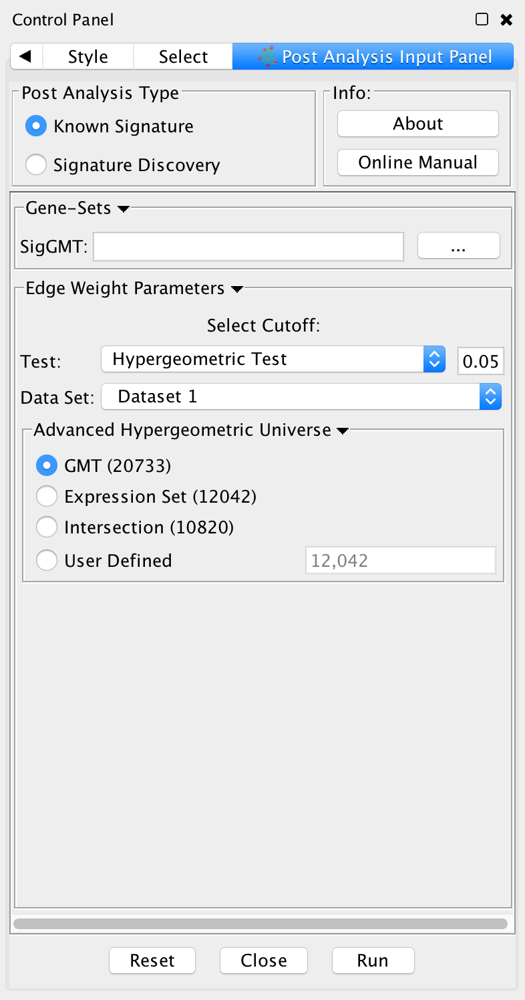
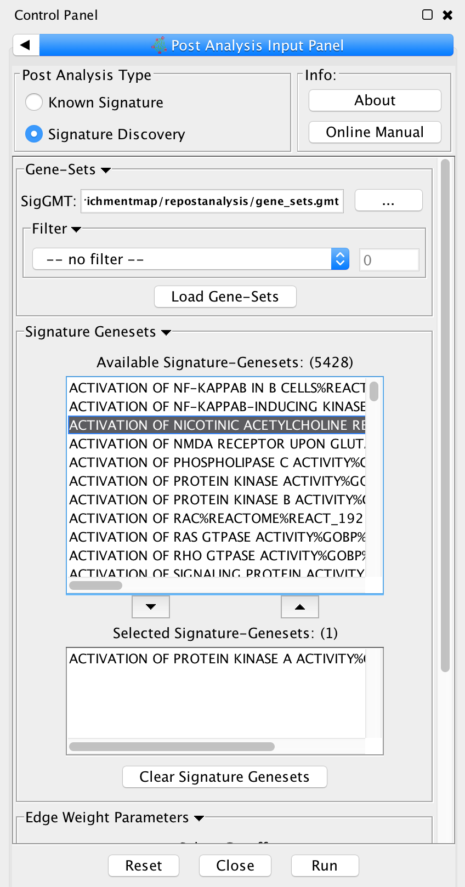
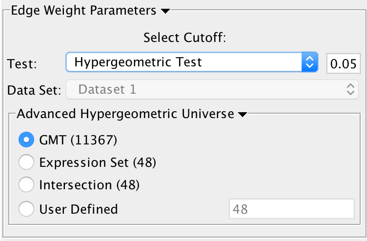
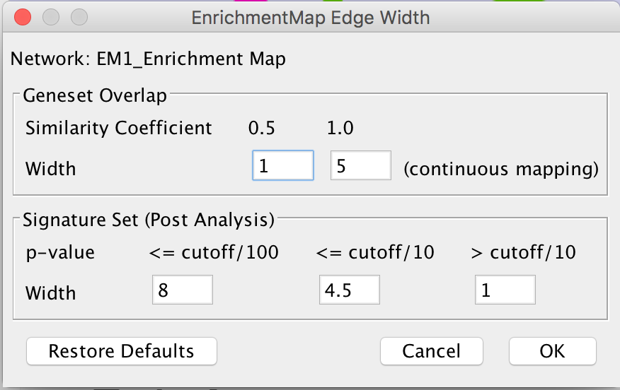

Interfaces
==========

The Input Panel
---------------

.. image:: images/EM_inputpanel_screenshot.png
   :align: right
   :width: 45%

1. **Analysis Type** - There are two distinct types of Enrichment map analyses, GSEA or Generic.

   * **GSEA** - takes as inputs the output files created in a GSEA analysis. File formats are 
     specific to files created by GSEA. The main difference between this and generic is 
     the number and format of the Enrichment results files. GSEA analysis always has two 
     enrichment results files, one for each of the phenotypes compared.
   * **Generic** - takes as inputs the same file formats as a GSEA analysis except the Enrichment 
     results file is a different format and there is only one enrichment file. Generic File 
     description
   * **DAVID** - (implemented in v1.0 and higher) has no gmt or expression file requirement and 
     takes as input enrichment result file as produced by DAVID David Enrichment Result File 
     description 

2. **Genesets** - path to gmt file describing genesets. User can browse hard drive to find 
   file by pressing ... button.
3. **Dataset 1** - User can specify expression and enrichment files or alternatively, 
   an rpt file which will populate all the fields in genesets,dataset # and advanced sections.
4. **Advanced** - Initially collapsed (expand by clicking on arrow head directly next to 
   Advanced), users have the option of modifying the phenotype labels or loading gene rank files.
5. **Parameters** - User can specify p-value, fdr and overlap/jaccard cutoffs. Choosing Optimal 
   parameter values
6. **Actions** - The user has three choices, Reset (clears input panel), Close (closes input panel), 
   and Build Enrichment map (takes all parameters in panel and builds an Enrichment map) 

The Data Panel (Expression Viewer)
----------------------------------

.. image:: images/EM_expressionviewer.png

There are two different types of Expression Viewers, each is represented as a separate tab 
in data panel: EM Overlap and EM Gene set. The only difference between the two expression 
viewers is the set of gene listed.

1. **EM Overlap Expression Viewer** - shows the expression of genes in the overlap (intersection) 
   of all the genesets selected
2. **EM Geneset Expression Viewer** - shows the expression of genes of the union of all the 
   genesets selected.

* **Normalization**

  * Data as is - represents the data as it was loaded
  * Row Normalize Data - for each value in a row of expression the mean of the row is 
    subtracted followed by division by the row's standard deviation.
  * Log Transform Data - takes the log of each expression value 

* **Sorting**

  * Hierarchical cluster - as computed using Pearson correlation of the entire expression set.
  * If rank files for the data sets are provided at input they will show up as 'Dataset 1 Ranking' 
    and 'Dataset 2 Ranking' and by selecting them the user will be able to sort the expression 
    accordingly

    * if an expression value does not have a corresponding rank in the ranking file its expression 
      does not appear in the heatmap. 

  * Add Ranking ... - allows user to upload an additional rank file (in the appropriate format, 
    as outlined in Rank file descriptions). There is no limit on the number of rank files that 
    are uploaded. The user is required to give a name to the rank file. 

* **Save Expression Set**

  * The user can save the subset of expression values currently being viewed in the expression 
    viewer as txt file. 

* **Export Expression Set (PDF)**

  * The user can save the expression heatmap currently being viewed in the expression viewer 
    as pdf file. Unfortunately the pdf version is not perfect. The column titles are at the 
    bottom instead of the top of the heatmap. Due to limitations with the current library being 
    used we are unable to fix this in cityscape 2.8.3 but hope to have a better pdf representation 
    in the EM version for Cytoscape 3.0. 

The Results Panel
-----------------

Reference panel containing legends, slider bars for the user to modify p-value and q-value 
cut-offs, parameters used for the analysis 

1. Phenotype 1
2. Phenotype 2
3. **P-value Cutoff tuner** - Allows you to adjust the p-value threshold used to filter the 
   gene sets.

   * By moving the slider to the left you can decrease the p-value threshold causing nodes 
     (and their edges) to be removed from the network.
   * Moving the slider back to the right will restore the nodes (and their edges).
   * You can NOT increase the p-value threshold above what you specified when you built 
     the network. 

4. **Q-value Cutoff tuner** - allows you to adjust the q-value threshold used to filter the gene sets.
        
   * By moving the slider to the left you can decrease the q-value threshold causing nodes 
     (and their edges) to be removed from the network.
   * Moving the slider back to the right will restore the nodes (and their edges).
   * You can NOT increase the q-value threshold above what you specified when you built the network. 

5. **Similarity Cutoff tuner** - allows you to adjust the similarity threshold used to filter 
   the gene set overlaps (edges).

   * By moving the slider to the right you can increase the similarity threshold causing 
     edges to be removed from the network.
   * Moving the slider back to the left will restore the edges.
   * You can NOT decrease the similarity threshold below what you specified when you built 
     the network. 

6. Button to launch index of GSEA results in a web browser.
7. List of parameters used to create the EM.
8. Heatmap Autofocus

   * selected by default
   * When you click on any node or edge in the network EM automatically updates the expression 
     viewer and makes the focus of the Data panel the overlap expression viewer. When using 
     other plugins in conjunction with EM this feature can get cumbersome.
   * To turn this off unselect "heatmap Autofocus". 

9. **Default Sorting order** - in the expression viewer genes can be sorted by Hierarchical 
   clustering, Ranks, Columns, or No sort. To set the default change selection.

10. **Default Distance Metric** - for hierarchical clustering there are three available 
    distance metrics that can be used to compute distances between genes. By default this 
    is set of pearson correlation. Update this parameter if you which to use one of the 
    other distance metrics.

PostAnalysis Input Panel
------------------------

To access Post Analysis go to the menu path: Apps > Enrichment Map > Load Post Analysis Panel.

There are currently two types of Post Analysis Available: Known Signature and Signature Discovery. 
The contents of the panel will change depending on the type of analysis chosen. Known signature 
mode calculates post analysis edges for a small subset of known gene-sets. Signature discovery 
mode allows for filtering of large set of potential signatures to help uncover most likely sets.

The result of running Post Analysis is a new node for each signature gene set (yellow triangle) 
and edges from the signature gene set to each existing gene set when the similarity passes the 
cutoff test.

A new visual style is also created and applied to the network after post analysis runs. This 
visual style is the same as the enrichment map style but with a few additions. Signature edges 
are pink, signature nodes are yellow triangles, and edge width mapping is calculated differently.

Known Signature
~~~~~~~~~~~~~~~

1. Post Analysis Type

   * Known Signature: Calculates the overlap between gene-sets of the current Enrichment Map 
     and all the gene sets contained in the provided signature file. 

2. Gene Sets

   * SigGMT: The gmt file with the signature-genesets. These will be compared against the 
     gene-sets from the current Enrichment Map. 

3. Edge Weight Parameters
 
   * Choose a method for generating an edge between a signature-geneset 
     and an enrichment geneset. Described in detail below.

4. Actions: 
 
   * Reset - clears input panel
   * Close - closes input panel
   * Run - takes all parameters in panel and performs the Post-Analysis

Signature Discovery
~~~~~~~~~~~~~~~~~~~

1. Post Analysis Type

   * Signature Discovery: Calculates the overlap between gene-sets of the current Enrichment 
     Map and the selected genesets. 

2. Gene-Sets

   * The gmt file with the signature-genesets.
   * Filter: Genesets from the gmt file that do not pass the filter test will not be loaded.
   * Load Gene-Sets: Press after the gmt file and filter have been chosen to load the 
     signature-genesets. 

3. Available Signature Genesets: Once the genesets have been loaded this box will contain a list 
   of all the genesets in the SigGMT file (that passed the filter).

   * To highlight more than one geneset at at time hold the Shift, Command or Ctrl keys while 
     clicking with the mouse. 

4. Selected Signature Genesets: The analysis will be performed with all genesets in this list. 
   Use the down- and up-buttons to move highlighted genesets from one list to the other.

5. Edge Weight Parameters: Choose a method for generating an edge between a signature-geneset 
   and an enrichment geneset. Described in detail below.

6. Actions: 
 
   * Reset - clears input panel
   * Close - closes input panel
   * Run - takes all parameters in panel and performs the Post-Analys

Edge Weight Parameters
~~~~~~~~~~~~~~~~~~~~~~

.. |formula| image:: images/Hypergeometric_test_Formula.png

1. Test: Select the type of statistical test to use for edge width.
2. Cutoff: Edges with a similarity value lower than the cutoff will not be created.
3. Data Set: If the enrichment map contains multiple data sets choose the one to use here.
4. Notes:

   * The results of the calculations will be available in the edge table after post analysis runs.
   * The edge “interaction type” will be sig.
   * The hypergeometric test is always calculated, even if it is not used for the cutoff. The 
     results are made available in the edge table. 

5. Available Tests

   * Hypergeometric Test is the probability (p-value) to find an overlap of k or more genes 
     between a signature geneset and an enrichment geneset by chance.
   
     |formula|

     with:

     | k (successes in the sample) : size of the Overlap,
     | n (size of the sample) : size of the Signature geneset
     | m (total number of successes) : size of the Enrichment Geneset
     | N (total number of elements) : size of the union of all Enrichment Genesets
     |

     * Advanced Hypergeometric Universe: Allows to choose the value for N.

       * GMT: all the genes in the original gmt file, Expression Set: number of genes in the 
         expression set, 
       * Intersection: number of genes in the intersection of the gmt file and expression set, 
       * User Defined: manually enter a value). 

  * Overlap has at least X genes

    * The number of genes in the overlap between the enrichment map gene set and the 
      signature gene set must be at least X for the edge to be created. 

  * Overlap is X percent of EM gs

    * The size of the overlap must be at least X percent of the size of the Enrichment Map gene set. 

  * Overlap is X percent of Sig gs
        
    * The size of the overlap must be at least X percent of the size of the Signature gene set. 

  * Mann-Whitney (Two-sided, one-sided greater, one-sided less)

    * Note: The Mann-Whitney test requires ranks. It will not be available if the enrichment map 
      was created without ranks.
    * Calculates the p-value using the Mann-Whitney U test where the first sample is the ranks 
      in the overlap and the second sample is all of the ranks in the expression set. 

Edge Width
~~~~~~~~~~

When you create an Enrichment Map network a visual style is created. The default edge width 
property is a continuous mapping to the “similarity_coefficient” column. After running 
post-analysis the rules for calculating edge width become more complicated. Edge width for 
edges between enrichment sets are still based on the “similarity_coefficient” column, but 
edges between signature sets and enrichment sets are based on the statistical test used 
for cutoff. Currently Cytoscape does not provide a visual mapping that is capable of “if-else” 
logic. In order to work around this limitation, the width of the edges is calculated by 
EnrichmentMap and put into a new column called “EM1_edge_width_formula”. Then the edge width 
property uses a continuous mapping to that column.

   
* Edge Width Dialog

  * In order to change the rules used to calculate edge width go to the menu path: 
    Apps > EnrichmentMap > Post Analysis Edge Width.
  * Geneset Overlap: Set the end points of the contiuous mapping for edge width for edges 
    between enrichment sets.
  * Signature Set: Set the edge width value for signature set edges that are less than 
    cutoff/100, <= cutoff/10 and > cutoff/10.
  * Click OK to recalculate the values in the “EM1_edge_width_formula” column. 
