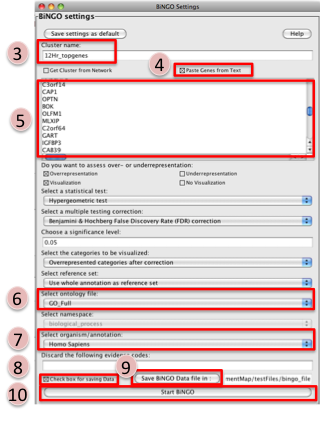
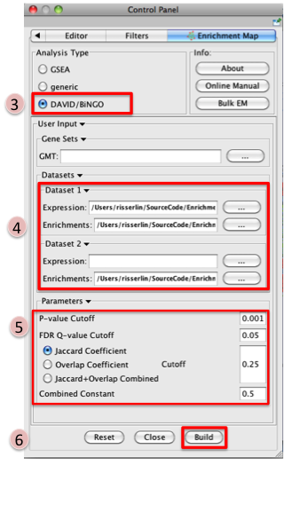
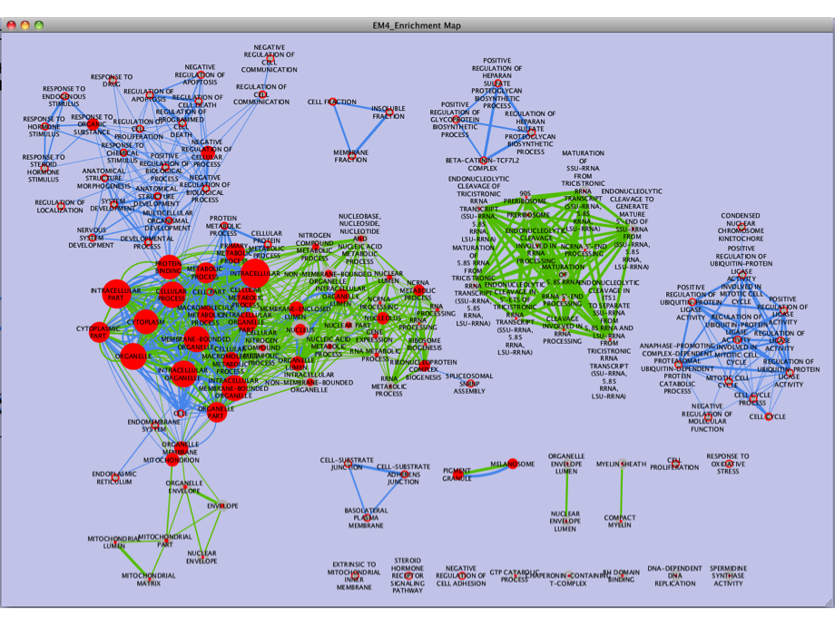

.. _bingo_tutorial:

BiNGO Tutorial
==============

.. _BiNGO A Biological Network Gene Ontology Tool: https://www.psb.ugent.be/cbd/papers/BiNGO/Home.html

This quick tutorial will guide you through the generation of an Enrichment Map for an analysis 
performed using the Cytoscape Plugin `BiNGO A Biological Network Gene Ontology Tool`_.

Files
~~~~~

Download the test data: :download:`BingoTutorial.zip <downloads/BingoTutorial.zip>`

Description of the tutorial files contained in the BingoTutorial folder:

* ``12hr_topgenes.txt`` List of top genes expressed in Estrogen dataset at 12hr - 
  Official Gene Symbol.
* ``24hr_topgenes.txt`` List of top genes expressed in Estrogen dataset at 24hr - 
  Official Gene Symbol.
* ``12hr_Bingo_Output.bgo`` : Estrogen treatment - 12hr BiNGO result chart
* ``24hr_Bingo_Output.bgo`` : Estrogen treatment - 24hr BiNGO result chart
* ``Estrogen_expression_file.txt``: Expression File - Estrogen treatment, 
  Official Gene Name as key. 

Step 1: Generate BiNGO output files
~~~~~~~~~~~~~~~~~~~~~~~~~~~~~~~~~~~

1. Open Cytoscape
2. Click on Plugins / Start Bingo v###
3. Enter the name "12hr_topgenes" in the text box marked Cluster name
4. Select the box Paste Genes from Text
5. Select and copy all genes in the tutorial file 12hr_topgenes.txt. Paste in large text box.
6. Change Select ontolgy file to GO_full
7. Change Select organism/annotation to Homo sapiens
8. Select the box Check box for saving Data
9. Click on Save BiNGO Data file in:. Navigate to desired folder and Click Save
10. Click on Start BiNGO 

.. note:: Repeat these steps for the 24hrs time-point and the file 24hr_topgenes.txt 

Step 2: Generate Enrichment Map with BiNGO Output
~~~~~~~~~~~~~~~~~~~~~~~~~~~~~~~~~~~~~~~~~~~~~~~~~

1. Open Cytoscape
2. Click on Plugins / Enrichment Maps / Load Enrichment Results
3. Make sure the Analysis Type is set to DAVID/BiNGO
4. Please select the following files by clicking on the respective (...) button and selecting 
   the file in the Dialog:

   * NO GMT file is required for BiNGO Analysis
   * Dataset 1 / Expression: *Estrogen_expression_file.txt* (OPTIONAL)
   * Dataset 1 / Enrichments: *12hr_Bingo_Output.bgo*
   * Click on "Dataset 2" to expand the panel
   * Dataset 2 / Expression: leave empty
   * Dataset 2 / Enrichments 1: *24hr_Bingo_Output.bgo* (OPTIONAL) 

5. Tune Parameters

   * P-value cut-off: *0.001*
   * Q-value cut-off: *0.05*
   * Overlap coefficient cut-off: *0.25*

6. Build Enrichment Map
7. Go to View, and activate Show Graphics Details 

.. note:: BiNGO accepts both Entrez Gene IDs [e.g.6672] or gene symbols [STAT1] as input. 
          If Entrez Gene IDs have been used as input, the first column of the expression 
          file should contain Entrez Gene IDs. Similarly, if gene symbols have been used 
          as input, the fist column of the expression file should contain gene symbols. 

Step 3: Examining Results
~~~~~~~~~~~~~~~~~~~~~~~~~

**Legend:**

1. Node (inner circle) size corresponds to the number of genes in dataset 1 within the geneset
2. Node border (outer circle) size corresponds to the number of genes in dataset 2 within the 
   geneset
3. Colour of the node (inner circle) and border(outer circle) corresponds to the significance 
   based on the BiNGO p-value of the geneset for dataset 1 and dataset 2, respectively.
4. Edge size corresponds to the number of genes that overlap between the two connected genesets. 
   Green edges correspond to both datasets when it is the only colour edge. When there are two 
   different edge colours, green corresponds to dataset 1 and blue corresponds to dataset 2.

.. note:: If you are using two enrichment sets you will see two different colours of edges in 
          the enrichment map. When the set of genes in the two datasets are different (for 
          example, when you are comparing two different species or when you are comparing 
          results from two different platforms) the overlaps are computed for each dataset 
          separately as there is a different set of genes that the enrichments were calculated 
          on. In this case, since the enrichments were reduced to only a subset of most 
          differentially expressed at each time point the set of genes the enrichments are 
          calculated on are different and overlap are calculated for each set separately. 
          