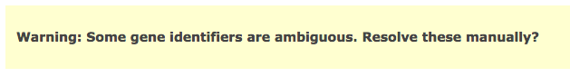
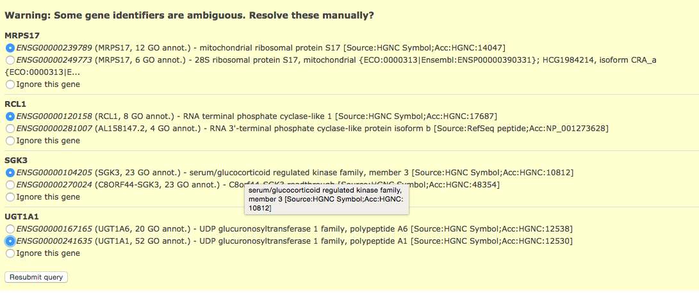
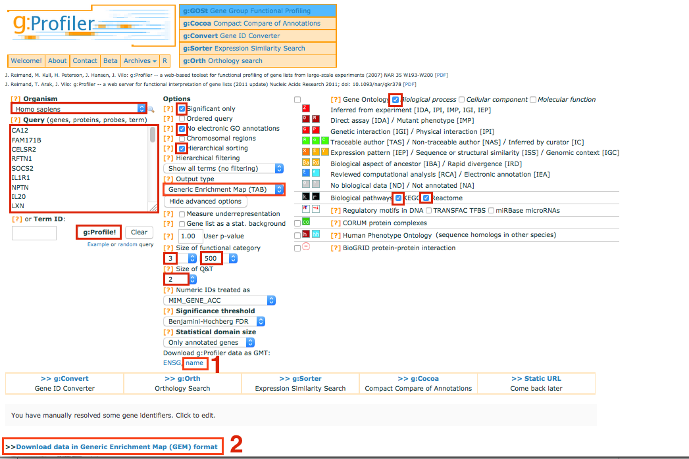
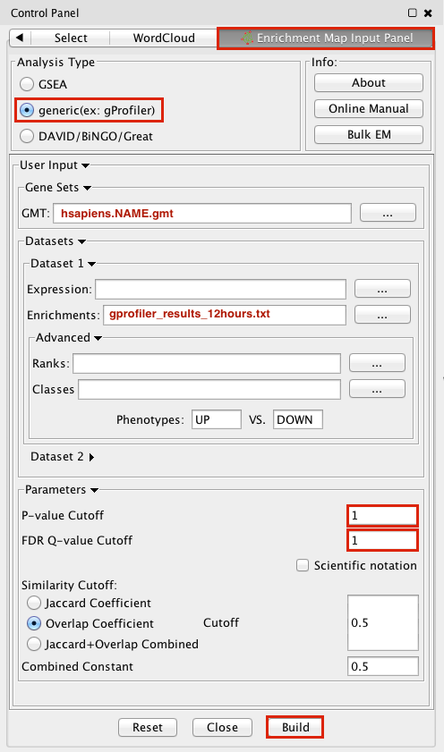
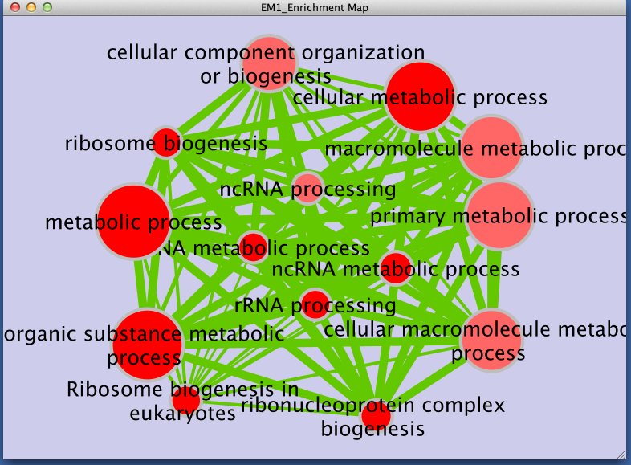

.. _gprofiler_tutorial:

g:Profiler Tutorial
===================

.. _`g:Profiler`: http://biit.cs.ut.ee/gprofiler/

This quick tutorial will guide you through the generation of an Enrichment Map for an 
analysis performed using `g:Profiler`_ (Functional Profiling of Gene List from large-scale 
experiments).

Files
~~~~~

Download the test data: :download:`gProfilerTutorial.zip <downloads/gProfilerTutorial.zip>`

Description of the tutorial files contained in the gProfilerTutorial folder:

* ``12hr_topgenes.txt`` List of top genes expressed in Estrogen dataset at 12hr - 
  Official Gene Symbol.
* ``24hr_topgenes.txt`` List of top genes expressed in Estrogen dataset at 24hr - 
  Official Gene Symbol. 

Step 1: Generate g:Profiler output files
~~~~~~~~~~~~~~~~~~~~~~~~~~~~~~~~~~~~~~~~

1. Go to `g:Profiler`_ website
2. Select and copy all genes in the tutorial file 12hr_topgenes.txt in the *Query* box. 
   Make sure that your list contains only official gene symbol (HUGO).
3. In Options, check Significant only, No electronic GO annotations
4. Set the Output type to Generic EnrichmentMap
5. Show advanced options
6. Set Min and Max size of functional category to 3 and 500 respectively.
7. Select 2 for Size of Q&T
8. On the right panel, choose the Gene Ontology Biological process and Reactome
9. Set Significance threshold to Benjamini-Hochberg FDR
10. Click on g:Profile! to run the analysis

    * [Note] - if some of your identifiers in your query have multiple mappings in 
      g:Profiler! by default they get excluded. If this happens you will see the following 
      above the g:Profiler! results: 

      |ss1|

    * Click on above link to manually map each gene to its correct annotation 

      |ss2|

    * Click on Resubmit query to update your results with the specified mappings.
    * If the identifier discrepancy warning is ignored there might be differences between 
      the number of genes g:Profiler attributes to a particular gene set and those associated 
      with it in the Enrichment Map.

11. Download g:Profiler data as gmt name Note, you will have to unzip the folder
12. Download the result file: Download data in Generic Enrichment Map (GEM) format

.. note:: Repeat these steps for the 24hrs time-point and the file 24hr_topgenes.txt 

Link to a step by step tutorial: :download:`gProfiler_step_by_step.pdf <downloads/gProfiler_step_by_step.pdf>`

Step 2: Generate Enrichment Map with g:Profiler Output
~~~~~~~~~~~~~~~~~~~~~~~~~~~~~~~~~~~~~~~~~~~~~~~~~~~~~~

g:Profiler output files from Step 1: :download:`gProfiler_EM.zip <downloads/gProfiler_EM.zip>`

1. Open Cytoscape 
2. In the menu bar, locate the App tab and then select > EnrichmentMap > Create Enrichment Map 
3. Make sure the Analysis Type is set to generic(ex:gProfiler) 
4. Please select the following files by clicking on the respective (...) button and selecting the file in the Dialog:

   * GMT / hsapiens.pathways.NAME.gmt
   * Dataset 1 / Enrichments: gProfiler_results_12hr.txt 

5. Tune Parameters

   * P-value cut-off: 1
   * Q-value cut-off: 1
   * Overlap Coefficient cut-off: 0.5 

6. Click on the Build radio button at the bottom of the panel to create the Enrichment Map 
7. In the menu bar, Go to View, and activate Show Graphics Details 
8. In the control panel, go to Style, click on Label and select EM1_GS_DESCR in the Column 
   dropdown. This will label nodes with names rather thsn GO IDs. The selected value may be 
   EM2_GS_DESCR or other if you have more than one Enrichment Map open in Cytoscape. 

Step 3: Examining Results
~~~~~~~~~~~~~~~~~~~~~~~~~

**Legend:**

* Node size corresponds to the number of genes in dataset 1 within the geneset
* Colour of the node corresponds to the significance of the geneset for dataset 1.
* Edge size corresponds to the number of genes that overlap between two connected genesets. 

