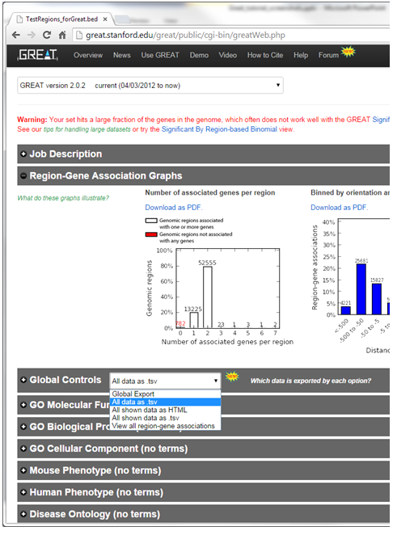
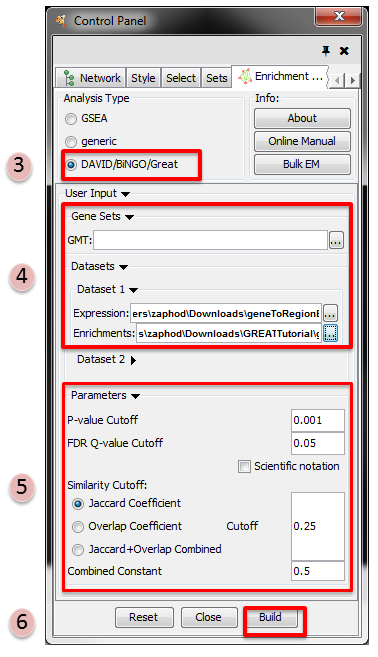
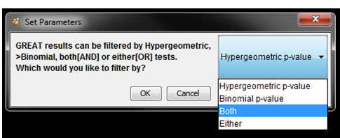
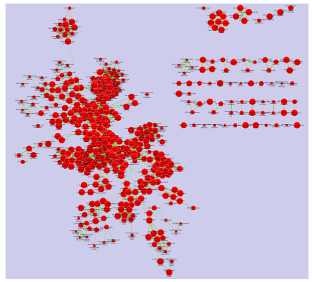

.. _great_tutorial:

GREAT Tutorial
==============

.. _Genomic Region Enrichment Annotation Tool: http://great.stanford.edu/great/public/html/
.. _GREAT: http://great.stanford.edu/great/public/html/

This quick tutorial will guide you through the generation of an Enrichment Map for an 
analysis performed using `Genomic Region Enrichment Annotation Tool`_ (GREAT_), 

Files
~~~~~

Download the test data: :download:`GREATTutorial.zip <downloads/GREATTutorial.zip>`

Description of the tutorial files contained in the GREATTutorial folder:

* ``TestRegions_ForGREAT.bed`` Example GREAT genomic region input file.
* ``GreatExprotAll.tsv`` Example of download GREAT output file.
* ``20140919-public-2.0.2-3vD5MB-hg19-all-gene.txt`` Example downloaded GREAT gene 
  to region association file.
* ``geneToRegionExpressionFile.txt`` Transformed gene to region association file 
  downloaded from GREAT. 

Step 1: Generate GREAT output files
~~~~~~~~~~~~~~~~~~~~~~~~~~~~~~~~~~~

1. GO to GREAT_ website
2. *Select Species Assembly* associated with your data. For this tutorial select *Human: GRCh37*
3. In *Test regions* click on *Choose File*
4. Navigate to files provided and select *TestRegions_forGreat.bed*
5. Click on *Submit*
6. Once the results page has loaded download all the results - in the *Global controls* 
   heading click on the down arrow next to *Global Export*
7. *Select All data as tsv* - greatExportAll.tsv will automatically be downloaded to your 
   default Downloads directory. This is the file you can use in Enrichment Map 
   (Dataset 1 or 2:Enrichment Results) 

Step 1B (Optional): Generate Gene to region association file 
~~~~~~~~~~~~~~~~~~~~~~~~~~~~~~~~~~~~~~~~~~~~~~~~~~~~~~~~~~~~

Optional - Download the Gene-to-region used by GREAT and modify it to be used in EM as an 
expression file.

1. In the *Global controls* heading click on the down arrow next to *Global Export*
2. Select *view all region-gene associations*
3. Next to *Gene > genomic region association table* [The table on the right hand side of 
   the page] click on *Download table as text*.
4. File will automatically downloaded into your default Downloads directory (file name is 
   similar to DATE-public-2.0.2-3vD5MB-hg19-all-gene.txt where DATE is the date of download. 
   Name will also change depending on the version of GREAT and genome selected).
5. Open the downloaded file in Excel.
6. Add a row to the top of the file.
7. In the first column enter "Name", and in the second column enter "Description" 

Step 2: Generate Enrichment Map with GREAT Output
~~~~~~~~~~~~~~~~~~~~~~~~~~~~~~~~~~~~~~~~~~~~~~~~~

1. Open Cytoscape
2. Click on Apps / Enrichment Maps / Load Enrichment Results
3. Make sure the Analysis Type is set to DAVID/BiNGO/GREAT
4. Please select the following files by clicking on the respective (...) button and selecting 
   the file in the Dialog:

   * *NO GMT file is required for GREAT Analysis*
   * Dataset 1 / Expression: ``!geneToRegionExpressionFile.txt`` (OPTIONAL)
   * Dataset 1 / Enrichments: ``!GreatExportAll.tsv`` 

5. Tune Parameters

   * P-value cut-off *0.001*
   * Q-value cut-off *0.05*
   * Jaccard coefficient cut-off *0.25* 

6. Build Enrichment Map 

Step 3: Filtering GREAT results
~~~~~~~~~~~~~~~~~~~~~~~~~~~~~~~

* Once the network starts to build a dialog will pop up asking you how you would 
  like to filter the GREAT results. There are four options:

  1. Use Hypergeometric test p-values and FDR only --> **Hypergeometric**
  2. Use Binomial test p-values and FDR only. --> **Binomial**
  3. Use both hypergeometric and binomial test p-values and FDR. Enrichment result must 
     pass threshold for both tests. --> **Both**
  4. Enrichment result must pass one of the above tests to be included in the 
     results --> **Either** 

* Select Both

Step 4: Examining Results
~~~~~~~~~~~~~~~~~~~~~~~~~

Legend:

* Node (inner circle) size corresponds to the number of genes in dataset 1 within the 
  geneset
* Colour of the node (inner circle) corresponds to the significance of the geneset for 
  dataset 1.
* Edge size corresponds to the number of genes that overlap between the two connected 
  genesets. 