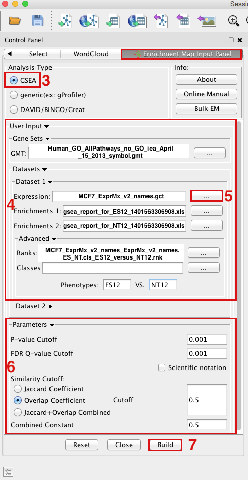

.. _gsea_tutorial:

GSEA Tutorial
=============

.. _GSEA Gene Set Enrichment Analysis: http://software.broadinstitute.org/gsea/index.jsp

This quick tutorial will guide you through the generation of an Enrichment Map for an 
analysis performed using `GSEA Gene Set Enrichment Analysis`_. 

Files
~~~~~

Download the test data: :download:`GSEATutorial.zip <downloads/GSEATutorial.zip>`

Description of the files contained in the GSEATutorial folder:

* ``ES_NT.cls`` Phenotype definition for expression file required by GSEA.
* ``MCF_ExpMX_v2_names.gct`` Expression File - Estrogen treatment, Official Gene 
  Name as key. - Data for 12hr,24hr and 48hr.
* ``Human_GO_AllPathways_no_GO_iea_April_15_2013_symbol.gmt`` Gene set definition file. 

Step 1: Generate GSEA output files
~~~~~~~~~~~~~~~~~~~~~~~~~~~~~~~~~~

.. image:: images/GSEA_tutorial.png
   :align: right
   :width: 50%

1. GO to `GSEA website <http://www.broadinstitute.org/gsea/>`_
2. Click on Downloads in the page header.

   * From the *javaGSEA Desktop Application* right click on *Launch with 1 Gb memory*.
   * Click on “Save Target as…” and save shortcut to your desktop or your folder of choice 
     so you can launch GSEA for your analysis without having to navigate to it through your 
     web browser. 

3. Double click on GSEA icon you created.
4. Click on *Load data* in left panel.
5. Click on *Browse for files*... in newly opened Load data panel.
6. Navigate to directory where you stored tutorial test set files. Select raw expression 
   (.gct) file, sample class file(.cls) and gene set (.gmt) file. Click on *Open*.
7. Wait until confirmation box appears indicating that all files loaded successfully. 
   Click on *Ok*.
8. Click on *Run GSEA* in left panel.
9. Select the *Expression dataset*:

   * Click on the arrow next to the *Expression dataset* text box.
   * Select the expression set you wish to run the analysis on (MCF7_ExprMx_v2_names.gct). 

10. Select the *Gene Set Database*:

    * Click on next to the text box of Gene Set Database.
    * Click on *Gene Matrix (local gmx/gmt)* tab.
    * Select gmt file Human_GO_AllPathways_no_GO_iea_April_15_2013_symbo.gmt 
      and click on *Ok*. 

11. Select the *Phenotype labels* file

    * Click on ... next to the text box of *Phenotype* labels.
    * Make sure *Select source file* is set to ES_NT.cls.
    * Select *ES12_versus_NT12* and click on *Ok*. 

12. Click on the down arrow next to the text box for *Collapse dataset to gene symbols*. 
    Select *false*.
13. Click on the down arrow next to the text box for *Permutation type*. Select gene_set.
14. Click on *Show* next to *Basic fields*.
15. Click in text box next to *Analysis name* and rename 
    (example:estrogen_treatment_12hr_gsea_enrichment_results).
16. Click on ... next to *Save results in this folder* text box. Navigate to the folder 
    where you wish to save the results (preferably the same directory where all the input 
    files have been saved).
17. Click on *Run* in the bottom right corner. 

.. note:: Repeat steps for the 24hrs time-point but use ES24_versus_NT24 phenotype labels 
          in step 11 instead and in step 15 change the Analysis name 
          (example:estrogen_treatment_24hr_gsea_enrichment_results).

Step 2: Generate Enrichment Map with GSEA Output
~~~~~~~~~~~~~~~~~~~~~~~~~~~~~~~~~~~~~~~~~~~~~~~~

GSEA results produced by Step 1: :download:`EM_EstrogenMCF7_GSEAresults.zip <downloads/EM_EstrogenMCF7_GSEAresults.zip>`

1. Open Cytoscape
2. Locate the Apps tab and select *EnrichmentMap > Create Enrichment Map*
3. Make sure the Analysis Type is set to GSEA
4. **OPTION 1** - Manually load all files Please select the following files by clicking 
   on the respective (...) button and selecting the file in the Dialog:

   * Gene Sets / GMT:
   * *Human_GO_AllPathways_no_GO_iea _April_15_2013_symbol.gmt* (can be found in directory 
     where you extracted the files downloaded in GSEATutorial.zip)
   * Dataset 1 / Expression: *MCF7_ExprMx_v2_names.gct* (can be found in directory where 
     you extracted the files downloaded in GSEATutorial.zip)
   * Dataset 1 / Enrichments 1: *gsea_report_for_ES12_#############.xls* (can be found in 
     directory where you put the GSEA results specified in Part 1, step 15)
   * Dataset 1 / Enrichments 2: *gsea_report_for_NT12_#############.xls* (can be found in 
     directory where you put the GSEA results specified in Part 1, step 15)
   * Click on *Advanced* to expand the panel
   * Dataset 1 / Ranks: *MCF7_ExprMx_v2_names_ExprMx_v2_names.ES_NT.cls_ES12_versus_NT12.rnk* 
     (OPTIONAL) (can be found in directory where you put the GSEA results specified in Part 1, 
     step 15)
   * Dataset 1 / Phenotypes 1: *ES12* VS *NT12* (OPTIONAL) 

5. **OPTION 2** - Populate all fields using GSEA rpt file

   * Dataset 1 / Expression : *ES12vsNT12.Gsea.#############.rpt* (can be found in directory 
     where you put the GSEA results specified in Part 1, step 15)
   * NOTE: If you are populating the fields using a rpt file and any of the file names appear 
     in red font then the file EM needs was not found. This can happen if you move your GSEA 
     results folders around after they have been created. For the missing file follow step 5 
     and re-populate the effected fields. 

6. Tune Parameters

   * P-value cut-off: *0.001*
   * Q-value cut-off: *0.05*
   * Overlap coefficient cut-off: *0.5*

7. Build Enrichment Map
8. Go to View, and activate Show Graphics Details 

Step 3: Examining Results
~~~~~~~~~~~~~~~~~~~~~~~~~

Example EM session - Estrogen treatment vs no treatment at 12hr 
:download:`ES12_EM_example.cys <downloads/ES12_EM_example.cys>`

.. image:: images/GSEA_EM.png

**Legend:**

1. Node (inner circle) size corresponds to the number of genes in dataset 1 within 
   the geneset
2. Colour of the node (inner circle) corresponds to the significance of the geneset 
   for dataset 1.
3. Edge size corresponds to the number of genes that overlap between the two connected 
   genesets. Green edges correspond to both datasets when it is the only colour edge. 
   When there are two different edge colours, green corresponds to dataset 1 and blue 
   corresponds to dataset 2. 

**GSEA Leading Edge Information:**

1. Click on a node (gene set) in the Enrichment map.
2. In the Data Panel, expression profile of all genes included in the selected gene-set should appear in the Heat Map (nodes) viewer tab
3. Change the Normalization to your desired metric.
4. Change the Sorting method to GSEARanking.
5. Genes part of the leading edge are highlighted in yellow. 

.. image:: images/GSEA_leadingedge.png

.. note:: Leading edge information is currently only available when looking at a 
          single gene set.

More Tutorials
~~~~~~~~~~~~~~

For more detailed tutorials check out:

* | `Visualizing gene-set enrichment results using the Cytoscape plug-in enrichment map. <https://www.ncbi.nlm.nih.gov/pubmed/21877285>`_
  | Merico D, Isserlin R, Bader GD. 
  | Methods Mol Biol. 2011;781:257-77. doi: 10.1007/978-1-61779-276-2_12.

* | `Global proteomic profiling and enrichment maps of dilated cardiomyopathy. <https://www.ncbi.nlm.nih.gov/pubmed/23606248>`_
  | Isserlin R, Merico D, Emili A. 
  | Methods Mol Biol. 2013;1005:53-66. doi: 10.1007/978-1-62703-386-2_5.

