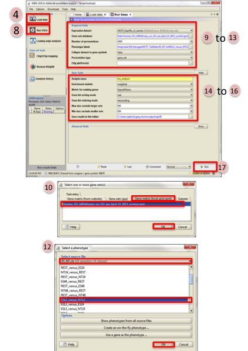
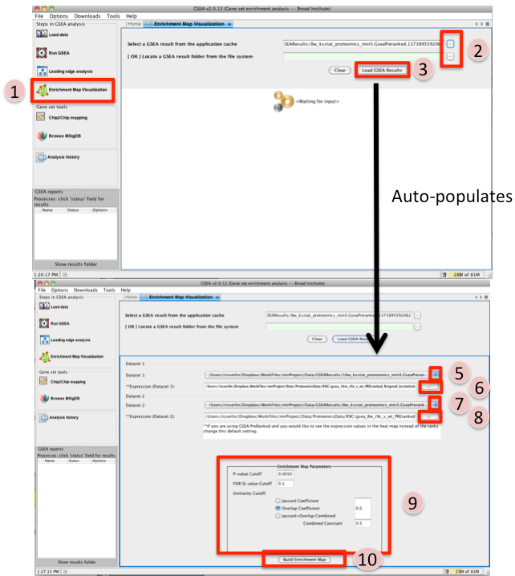
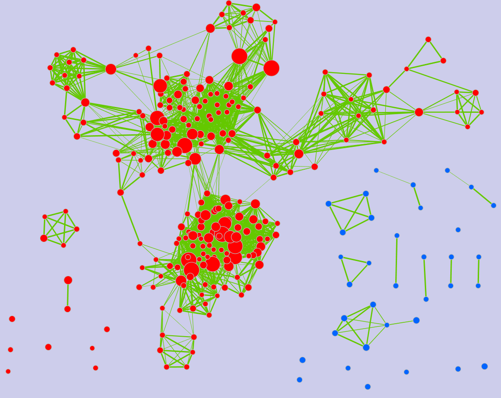
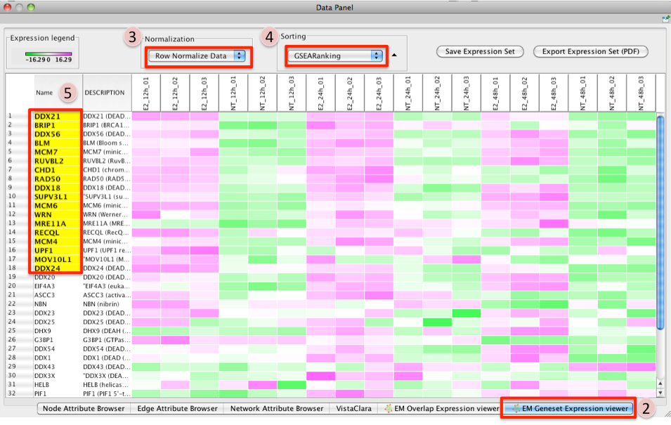

.. _gsea_tutorial_interface:

GSEA Tutorial - GSEA Interface
==============================

.. _GSEA Gene Set Enrichment Analysis: http://software.broadinstitute.org/gsea/index.jsp

This quick tutorial will guide you through the generation of an Enrichment Map for an 
analysis performed using `GSEA Gene Set Enrichment Analysis`_ directly from the GSEA interface. 

Files
~~~~~

Download the test data: :download:`GSEATutorial.zip <downloads/GSEATutorial.zip>`

Description of the files contained in the GSEATutorial folder:

* ``ES_NT.cls`` Phenotype definition for expression file required by GSEA.
* ``MCF_ExpMX_v2_names.gct`` Expression File - Estrogen treatment, Official Gene 
  Name as key. - Data for 12hr,24hr and 48hr.
* ``Human_GO_AllPathways_no_GO_iea_April_15_2013_symbol.gmt`` Gene set definition file. 

Step 1: Generate GSEA output files
~~~~~~~~~~~~~~~~~~~~~~~~~~~~~~~~~~

1. GO to `GSEA website <http://www.broadinstitute.org/gsea/>`_
2. Click on Downloads in the page header.

   * From the *javaGSEA Desktop Application* right click on *Launch with 1 Gb memory*.
   * Click on “Save Target as…” and save shortcut to your desktop or your folder of choice 
     so you can launch GSEA for your analysis without having to navigate to it through your 
     web browser. 

3. Double click on GSEA icon you created.
4. Click on *Load data* in left panel.
5. Click on *Browse for files*... in newly opened Load data panel.
6. Navigate to directory where you stored tutorial test set files. Select raw expression 
   (.gct) file, sample class file(.cls) and gene set (.gmt) file. Click on *Open*.
7. Wait until confirmation box appears indicating that all files loaded successfully. 
   Click on *Ok*.
8. Click on *Run GSEA* in left panel.
9. Select the *Expression dataset*:

   * Click on the arrow next to the *Expression dataset* text box.
   * Select the expression set you wish to run the analysis on (MCF7_ExprMx_v2_names.gct). 

10. Select the *Gene Set Database*:

    * Click on next to the text box of Gene Set Database.
    * Click on *Gene Matrix (local gmx/gmt)* tab.
    * Select gmt file Human_GO_AllPathways_no_GO_iea_April_15_2013_symbo.gmt 
      and click on *Ok*. 

11. Select the *Phenotype labels* file

    * Click on ... next to the text box of *Phenotype* labels.
    * Make sure *Select source file* is set to ES_NT.cls.
    * Select *ES12_versus_NT12* and click on *Ok*. 

12. Click on the down arrow next to the text box for *Collapse dataset to gene symbols*. 
    Select *false*.
13. Click on the down arrow next to the text box for *Permutation type*. Select gene_set.
14. Click on *Show* next to *Basic fields*.
15. Click in text box next to *Analysis name* and rename 
    (example:estrogen_treatment_12hr_gsea_enrichment_results).
16. Click on ... next to *Save results in this folder* text box. Navigate to the folder 
    where you wish to save the results (preferably the same directory where all the input 
    files have been saved).
17. Click on *Run* in the bottom right corner. 

Step 2: Generate Enrichment Map
~~~~~~~~~~~~~~~~~~~~~~~~~~~~~~~

1. Once GSEA has completed click in the Steps in GSEA analysis panel click on Enrichment 
   Map Visualization. When you click on the Steps in GSEA analysis cytoscape 3.3 or higher 
   should automatically be launched. It will take a few seconds for cytoscape to load. If 
   you try and create a network before it is finished initializing GSEA will not be able 
   to communicate with cytoscape yet. *(In Cytoscape 3.3.0 the Cyotscape splash screen will 
   not disappear until it has finished initializing but in later version you will be able 
   to configure the Enrichment map parameters within GSEA while cytoscape is initializing)*.
2. Navigate to the analysis or analyses you wish to create an enrichment map for. There are 
   two ways to do this:

   * click on the ... next to Select a GSEA result from the application cache. From the list 
     select the set of analyses to load. (hold down CTRL or COMMAND key to select multiple 
     analyses). Click on OK. B. click on the ... next to [OR] Locate a GSEA result folder 
     from the file system. Navigate to the GSEA result directory you wish to use. Click on OK. 

3. Click on Load GSEA Results. *NOTE: if the GSEA analysis was performed on a dataset that 
   was not collapsed it will take a few seconds for the information to load as it needs to 
   collapse it first.*
4. Bottom frame will appear, auto-populating file fields according to the GSEA results folders 
   specified. Multiple GSEA folders can be specified. If more than one folder is specified 
   bottom frame will contain specifications for two datasets. If only one directory is specified 
   then only one dataset will be accommodated.
5. The user can specify which of the datasets to use as dataset 1 by selecting dataset from 
   drop down list. Selecting a different dataset will automatically populate 
   *Expression(Dataset 1)* with the corresponding expression file.
6. If you have conducted a GSEA analysis on a Preranked list of genes but wish to see the 
   original expression file associated with your enrichment map update the path to the 
   expression file next to Expression (Dataset 1).
7. The user can specify which of the datasets to use as dataset 2 by selecting dataset from 
   drop down list. Selecting a different dataset will automatically populate 
   Expression(Dataset 2) with the corresponding expression file.
8. If you have conducted a GSEA analysis on a Preranked list of genes but wish to see the 
   original expression file associated with your enrichment map update the path to the 
   expression file next to Expression (Dataset 2).
9. Tune Parameters. Check out :ref:`parameters` (check out tips for choosing parameters)

   * P-value cut-off: *0.001*
   * Q-value cut-off: *0.05*
   * Overlap coefficient cut-off: *0.5*

10. Click on Build Enrichment Map
11. Cytoscape should launch and create your Enrichment map.
12. Go to View, and activate Show Graphics Details 

Step 3: Examining Results
~~~~~~~~~~~~~~~~~~~~~~~~~

Example EM session - Estrogen treatment vs no treatment at 12hr 
:download:`ES12_EM_example.cys <downloads/ES12_EM_example.cys>`

**Legend:**

1. Node (inner circle) size corresponds to the number of genes in dataset 1 within 
   the geneset
2. Colour of the node (inner circle) corresponds to the significance of the geneset 
   for dataset 1.
3. Edge size corresponds to the number of genes that overlap between the two connected 
   genesets. Green edges correspond to both datasets when it is the only colour edge. 
   When there are two different edge colours, green corresponds to dataset 1 and blue 
   corresponds to dataset 2. 

**GSEA Leading Edge Information:**

1. Click on a node (gene set) in the Enrichment map.
2. In the Data Panel, expression profile of all genes included in the selected gene-set should appear in the Heat Map (nodes) viewer tab
3. Change the Normalization to your desired metric.
4. Change the Sorting method to GSEARanking.
5. Genes part of the leading edge are highlighted in yellow. 

.. note:: Leading edge information is currently only available when looking at a 
          single gene set.

More Tutorials
~~~~~~~~~~~~~~

For more detailed tutorials check out:

* | `Visualizing gene-set enrichment results using the Cytoscape plug-in enrichment map. <https://www.ncbi.nlm.nih.gov/pubmed/21877285>`_
  | Merico D, Isserlin R, Bader GD. 
  | Methods Mol Biol. 2011;781:257-77. doi: 10.1007/978-1-61779-276-2_12.

* | `Global proteomic profiling and enrichment maps of dilated cardiomyopathy. <https://www.ncbi.nlm.nih.gov/pubmed/23606248>`_
  | Isserlin R, Merico D, Emili A. 
  | Methods Mol Biol. 2013;1005:53-66. doi: 10.1007/978-1-62703-386-2_5.

