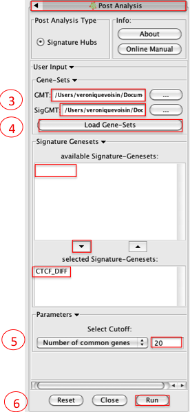
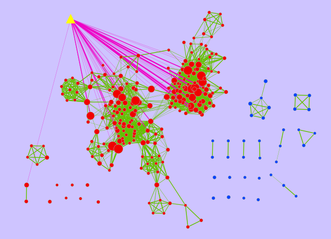
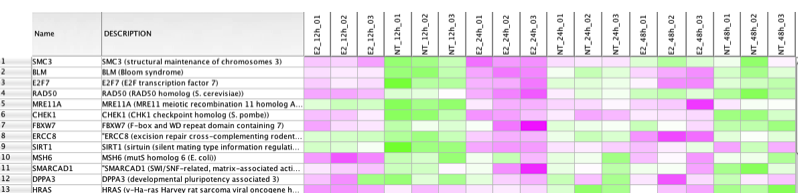

.. _pa_tutorial:

Post Analysis Tutorial
======================

Outline
~~~~~~~

This quick tutorial will guide you through the creation of an additional gene-set on a 
pre-existing Enrichment Map. It can for example help to localize microRNA, transcription 
factors or drug targets in enriched pathways displayed on the map. The new gene-set that 
we want to add to the network is called the signature gene-set. 

Download the test data: :download:`PostAnalysisTutorial.zip <downloads/PostAnalysisTutorial.zip>`

Description of the tutorial files contained in the PostAnalysisTutorial folder:

* ``CTCF_DIFF.gmt`` Signature gene-set.
* ``Human_GO_AllPathways_no_GO_iea_April_15_2013_symbol.gmt`` Gene-set file used to create 
  the original Enrichment Map
* ``ES12_EM_example.cys`` The Enrichment Map on which we want to add the signature gene-set 

Instructions
~~~~~~~~~~~~

1. Open Cytoscape and Open ES12_EM_example.cys 
2. Click on Plugins / Enrichment Map/ Post Analysis 
3. Please select the following files by clicking on the respective (...) button and selecting the file in the Dialog:

   * GMT / 'Human_GO_AllPathways_no_GO _iea_April_15_2013_symbol.gmt'
   * SigGMT / 'CTCF_DIFF.gmt' 

4. Click on Load Gene-Sets

   * In the Signature-Genesets box: click on CTCF_DIFF as available Signature-Genesets
   * Click on the down arrow to move CTCF_DIFF in the lower box 

5. Tune parameters

   * Set Number of common genes to 20 

6. Click on Run

Examining Results
~~~~~~~~~~~~~~~~~

:download:`ES12_EM_example_PA_CTCF_Diff.cys <downloads/ES12_EM_example_PA_CTCF_Diff.cys>`

* The yellow triangle is the signature gene-set and the pink edges represent overlap 
  of 20 genes or more between the signature gene-set and a given gene-set from the 
  Enrichment Map (red node). The width of the pink edges is proportional to the number 
  of genes in the overlap.
* This signature gene-set represents the CTCF (transcription factor) target genes that
  are different in MCF7 cells treated or not with Estrogen.
* Clicking on a pink edge will show the genes contained in this overlap in the gene 
  expression panel:

.. note:: The gene-signature gene-set corresponds to ENCODE CHIP-seq data for the cell 
   line MCF-7 treated or not with estrogen and for the CTCF factor using the tool 
   CSCAN/Browse data (http://159.149.160.51/cscan/). The signature gene-set includes 
   the genes that were different between the two conditions (treated or not with estrogen) 