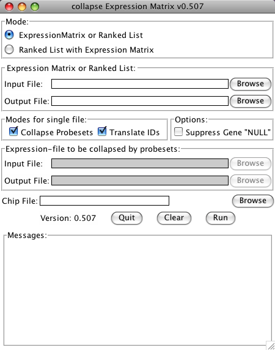

.. _collapse_ExpressionMatrix:

collapse_ExpressionMatrix.py
============================

Download :download:`collapse_ExpressionMatrix.py <downloads/collapse_ExpressionMatrix.py>`.

This tool can process a gene expression matrix (in GCT or TXT format) ranked list 
(RNK format) and:

* convert the Identifier based on a Chip Annotation file (e.g. AffyID -> Gene Symbol)
* collapse the expression values or rank-scores for Genes from more than one probe set. 

Converting and collapsing can be done either individually or both at the same time.

In case you are collapsing a ranked list (RNK format) to perform a "preRanked GSEA" that 
you later on want to analyze with EnrichmentMap and want to see an expression heatmap for 
the genesets, you need to generate an expression matrix that contains the expression values 
from the same probesets that were chosen to represent the gene in the ranked list. This can 
by selecting the ranked List (RNK) as the primary input file (-i) and the expression Matrix 
(GCT or TXT) as additional input Expression-table (-e). When using the GUI this can be done 
by selecting the mode "Ranked List with Expression Matrix".

In this use-case ID-conversion and collapsing have to be done in the same step. The DESCRIPTION 
column of the collapsed expression matrix will for every given gene then contain the Probeset-ID 
of the Probeset with the highest absolute Score in the RNK file and in brackets followed by a 
list of Probeset-IDs that where omitted due to lower absolute rank-scores.

The option 'Suppress gene "NULL"' (--null) will drop all Probeset ID's assigned to the Gene 
Symbol NULL, as this is used for probesets that are not linked to any Gene in several 
Chip-Annotation files available from the Broad Institute's FTP server. (These will be dropped 
by GSEA anyway).

Requirements
------------

* Python 2.3 or newer (but not Python 3.x!)
* the Tkinter Library (comes with most Python installations) for the GUI 

Supported Operating Systems:

* MacOS X 10.5 "Leopard" ore newer (probably also MacOS X 10.4 "Tiger")
* Windows (download and install the most recent version of Python 2.x from: 
  http://www.python.org/download/ or http://www.activestate.com/activepython/downloads/
* Linux (Python and Tcl/Tk are probably already installed out of the box, otherwise 
  install the packages with your Distribution's package manager) 

GUI Mode
--------

collapse_ExpressionMatrix.py now has a Tk-based Graphical User Interface (GUI). 
To use the GUI, just start the program without any arguments. This can be done:

* on Windows: double-click on the collapse_ExpressionMatrix.py-file
* on MacOS 10.5 or newer with installed "Developer Tools":

  * Control-click (or right-click) on the collapse_ExpressionMatrix.py-file in the finder 
    and choose "Open With/Build Applet.app"
  * This will create an MacOS Application collapse_ExpressionMatrix.app which can be started 
    by double clicking. 

* on MacOS, Linux or other Unix-like Systems in a Terminal/Shell: see in section 
  "Command Line Mode" how to make the program executable.

After starting the GUI:

* for collapsing either an expression matrix or Ranked gene list:

  1. select mode "Expression Matrix or Ranked List"
  2. use the first Browse-Button to select an Expression Matrix or Ranked gene list as an input file.
  3. use the second Browse-Button to choose a name and location of the output file (the program 
     will suggest to use the same name as the input file with an inserted "_collapsed" before the 
     extension)
  4. choose if the Identifiers should be converted or the file should be collapsed by checking 
     the check-boxes
  5. choose if the Gene Symbol "NULL" should be dropped
  6. if Identifiers are to be converted, choose a matching chip file
  7. start the conversion by clicking the Run button

* for collapsing a Ranked gene list and generating an expression matrix containing the same probesets:

  1. select Mode "Ranked List with Expression Matrix"
  2. use the first Browse-Button to select the Ranked gene list as an input file.
  3. use the second Browse-Button to choose a name and location of the Ranked gene list output 
     file (the program will suggest to use the same name as the input file with an inserted 
     "_collapsed" before the extension)
  4. choose if the Gene Symbol "NULL" should be dropped
  5. use the third Browse-Button to select an Expression Matrix input file
  6. use the fourth Browse-Button to choose a name and location of the Expression Matrix output file
  7. choose a matching chip file
  8. start the conversion by clicking the Run button 

Command Line Mode
-----------------

If you are familiar with command line tools under Unix/Linux, ``collapse_ExpressionMatrix.py -h`` 
gives you all the information you need (if not, see below): ::

    $ collapse_ExpressionMatrix.py -h
    Usage: collapse_ExpressionMatrix.py [options] -i input.gct -o output.gct [-c platform.chip] [--collapse]

    This tool can process a gene expression matrix (in GCT or TXT format) or
    ranked list (RNK format) and either replace the Identifier based on a Chip
    Annotation file (e.g. AffyID -> Gene Symbol), or collapse the expression
    values or rank-scores for Genes from more than one probe set. Both can be done
    in one step by using both '-c platform.chip' and '--collapse' at the same
    time. If a ranked list is to be collapsed, an additional expression matrix can
    be supplied by the -e/-x parameters and will be filtered to contain the same
    probe-sets as selected from the RNK file. If however the file supplied by -i
    is not recognized as a RNK file, these options have no effect.  For detailed
    descriptions of the file formats, please refer to:
    http://www.broadinstitute.org/cancer/software/gsea/wiki/index.php/Data_formats
    Call without any parameters to select the files and options with a GUI
    (Graphical User Interface)

    Options:
      --version             show program's version number and exit
      -h, --help            show this help message and exit
      -i FILE, --input=FILE
                            input expression table or ranked list
      -o FILE, --output=FILE
                            output expression table or ranked list
      -c FILE, --chip=FILE  Chip File This implies that the Identifiers are to be
                            replaced.
      -e FILE, --ei=FILE    (optional) additional input Expression-table, to be
                            restricted to the same probe-sets as the RNK file
      -x FILE, --xo=FILE    (optional) corresponding output file for -i/--ei
                            option
      --collapse            Collapse multiple probe sets for the same gene symbol
                            (max_probe)
      --no-collapse         Don't collapse multiple probesets [default]
      --null                suppress Gene with Symbol NULL
      -g, --gui             Open a Window to choose the files and options.
      -q, --quiet           be quiet

**MacOS and Linux**

On MacOS and Linux you need to make the program executable. Therefore:

* copy the file to a directory, e.g. ``${HOME}/bin``
* open a Terminal
* set the executable flag:

  ``chmod a+x ${HOME}/bin/collapse_ExpressionMatrix.py``

* if the ``${HOME}/bin`` directory is not in your search Path (test by 
  running ``collapse_ExpressionMatrix.py`` from a terminal) add it by adding 
  the line ``export PATH=$HOME/bin:$PATH`` to your ``${HOME}/.bash_profile`` 
  using your favourite text editor (pico, vi, emacs, gedit, TextWrangler, etc.) 
  or with the command

  ``echo export PATH=\$HOME/bin:\$PATH >> ${HOME}/.bash_profile``

  or refer to your local SysAdmin for any other shell that bash.

* open a new terminal or run source ``${HOME}/.bash_profile``
* test with ``collapse_ExpressionMatrix.py -h``

**Windows**

* copy the file to a directory, e.g. ``C:\bin``
* open the Conrtol Panel
* open System
* go to Advanced System Settings (on Vista and 7 only)
* go to the Advanced Tab
* Click on Environment-button
* if in the section "User variables for {USERNAME}" there is already an entry called "PATH":

  * click on Edit...
  * append ``;C:\bin`` at the very end 

* otherwise click on New...

  * Variable Name: ``PATH``
  * Variable Value: ``%PATH%;C:\bin``

* open a Command Prompt (Programs/Accessories)
* test with ``collapse_ExpressionMatrix.py -h``
