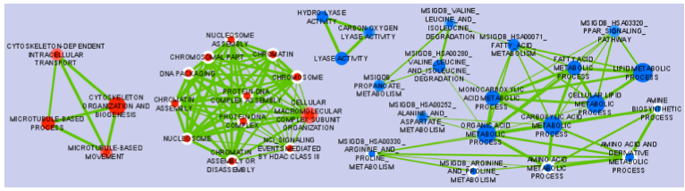

EnrichmentMap Cytoscape App 2.2
===============================

The Enrichment Map Cytoscape Plugin allows you to visualize the results of gene-set enrichment as a 
network. It will operate on any generic enrichment results as well as specifically on Gene Set 
Enrichment Analysis (GSEA) results. Nodes represent gene-sets and edges represent mutual overlap; 
in this way, highly redundant gene-sets are grouped together as clusters, dramatically improving 
the capability to navigate and interpret enrichment results.

Gene-set enrichment is a data analysis technique taking as input:

1. A (ranked) gene list, from a genomic experiment
2. gene-sets, grouping genes on the basis of a-priori knowledge (e.g. Gene Ontology) or experimental
   data (e.g. co-expression modules) 

and generating as output the list of enriched gene-sets, i.e. best sets that summarizing the 
gene-list. It is common to refer to gene-set enrichment as functional enrichment because functional 
categories (e.g. Gene Ontology) are commonly used as gene-sets. 

Cite EnrichmentMap
------------------

* | **Enrichment Map: A Network-Based Method for Gene-Set Enrichment Visualization and Interpretation**
  | Merico D, Isserlin R, Stueker O, Emili A, Bader GD
  | `PLoS One. 2010 Nov 15;5(11):e13984 <http://journals.plos.org/plosone/article?id=10.1371/journal.pone.0013984>`_.
  | `PubMed Abstract <https://www.ncbi.nlm.nih.gov/pubmed/21085593>`_ - :download:`PDF <downloads/2010_MericoIsserlinStuekerBader-EnrichmentMap_PLoSOne.pdf>`

Examples of Use
---------------

* | **Functional impact of global rare copy number variation in autism spectrum disorders.**
  | Pinto D, Pagnamenta AT, Klei L, Anney R, Merico D, Regan R, Conroy J, Magalhaes TR, Correia C, Abrahams BS, Almeida J, Bacchelli E, Bader GD, et al.
  | `Nature. 2010 Jun 9 (Epub ahead of print) <https://www.nature.com/articles/nature09146>`_
  | `PubMed Abstract <https://www.ncbi.nlm.nih.gov/pubmed/20531469>`_ - :download:`PDF <downloads/2010_AutismNature.pdf>`
  | `Nature Blogs <http://blogs.nature.com/news/2010/06/rare_genetic_variants_linked_t.html>`_ 

* | **Pathway analysis of dilated cardiomyopathy using global proteomic profiling and enrichment maps**
  | Isserlin R, Merico D, Alikhani-Koupaei R, Gramolini A, Bader GD, Emili A.
  | `Proteomics 2010, March 10(6):1316-27 <http://onlinelibrary.wiley.com/doi/10.1002/pmic.200900412/abstract>`_
  | `Pubmed Abstract <https://www.ncbi.nlm.nih.gov/pubmed/20127684>`_ - :download:`PDF <downloads/2010_EM_proteomics.pdf>`

Papers Citing Enrichment Map
----------------------------

* | `Citations in Pubmed Central <https://www.ncbi.nlm.nih.gov/pubmed?db=pubmed&cmd=link&linkname=pubmed_pubmed_citedin&uid=21085593>`_

* | **Pathway analysis of expression data: deciphering functional building blocks of complex diseases.**
  | Emmert-Streib F, Glazko GV.
  | PLoS Comput Biol. 2011 May;7(5):e1002053.
  | `PubMed <https://www.ncbi.nlm.nih.gov/pubmed/21637797>`_

* | **Inflammasome is a central player in the induction of obesity and insulin resistance.**
  | Stienstra R, van Diepen JA, Tack CJ, Zaki MH, van de Veerdonk FL, Perera D, Neale GA, Hooiveld GJ, Hijmans A, Vroegrijk I, van den Berg S, Romijn J, Rensen PC, Joosten LA, Netea MG, Kanneganti TD.
  | Proc Natl Acad Sci U S A. 2011 Aug 29.
  | `PubMed <https://www.ncbi.nlm.nih.gov/pubmed/21637797>`_

* | **Delineation of Two Clinically and Molecularly Distinct Subgroups of Posterior Fossa Ependymoma**
  | Witt H, Mack SC, Ryzhova M, Bender S, Sill M, Isserlin R, Benner A, Hielscher T, Milde T, Remke M, Jones DTW, Northcott PA, Garzia L, Bertrand KC, Wittmann A, Yao Y, Roberts SS, Massimi L, Van Meter T, Weiss WA, Gupta N, Grajkowska W, Lach B, Cho YJ, von Deimling A, Kulozik AE, Witt O, Bader GD, Hawkins CE, Tabori U, Guha A, Rutka JT, Lichter P, Korshunov A, Taylor MD, Pfister SM
  | `Cancer Cell, Volume 20, Issue 2, 143-157, 16 August 2011 <https://www.sciencedirect.com/science/article/pii/S1535610811002625>`_
  | `PubMed Abstract <https://www.ncbi.nlm.nih.gov/pubmed/21840481>`_ - :download:`PDF <downloads/ependymoma.pdf>`

Report a Bug or a Problem
-------------------------

* please make sure you don't have formatting issues

     if you are still not sure how to handle formats,
     or you don't know what's the best suitable analysis for you,
     please send an email to: daniele[AT]merico[DOT]gmail.com 

* please check what's your

  * plugin version and build (from the Cytoscape menu / Plugins / Enrichment Map / About)
  * Cytoscape version (from the Cytoscape menu / Cytoscape)
  * Operating System (e.g. Windows Vista) 

and send your bug report to ruth[DOT]isserlin[AT]utoronto.ca

OR

report the bug to the Enrichment map issue tracker:

* go to https://github.com/BaderLab/EnrichmentMapApp
* click on "Issues"
* click on "New Issue"
* write a short description of the issue
* attached session file (.cys) file or example input files if applicable
* Make sure to enter plugin version and build, cytoscape version and operating system.
* click on "Submit new issue" 

.. toctree::
   :maxdepth: 3
   :caption: User Guide

   Installing
   QuickStartGuide
   FileFormats
   Parameters
   Interfaces
   Attributes
   AdditionalFeatures
   GeneSets
   DavidTutorial
   ExamplesOfGenericEnrichmentResultFiles
   collapse_ExpressionMatrix.py
  

.. toctree::
   :maxdepth: 2
   :caption: Links
   
   Baderlab.org <http://baderlab.org>
   Baderlab genesets collections <http://download.baderlab.org/EM_Genesets/current_release>
   Cytoscape.org <http://cytoscape.org>
   Cytoscape App Store <http://apps.cytoscape.org/apps/enrichmentmap>
   GitHub <https://github.com/BaderLab/EnrichmentMapApp>